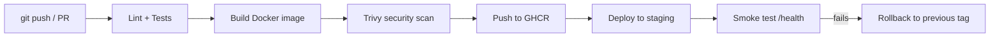

# CI/CD Pipeline for a Web Service

```mermaid
flowchart LR
    A[git push / PR] --> B[Lint + Tests]
    B --> C[Build Docker image]
    C --> D[Trivy security scan]
    D --> E[Push to GHCR]
    E --> F[Deploy to staging]
    F --> G[Smoke test /health]
    G -->|fails| H[Rollback to previous tag]
```